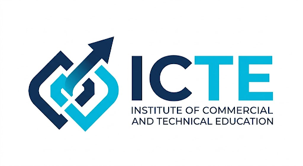

<div align="center">
  
  <br /><br />
  <h1 style="margin: 0; font-size: 2.5rem; font-weight: 800; letter-spacing: -0.02em; color: #1E40FF;">ICTE Hub</h1>
  <p style="font-size: 1.1rem; color: #64748b; margin-top: 0.25rem;">
    <strong>University Discovery &amp; Student Enrollment Platform</strong>
  </p>
  <br />
  <p>
    
    
    
    
    
    
  </p>
  <br />
</div>

---

<div align="center">
  <p style="font-size: 1.05rem; color: #334155; max-width: 700px; line-height: 1.7;">
    A full-stack platform for discovering universities, managing student leads, 
    tracking enrollments, and handling commissions. Built with <strong>Next.js 15</strong>, 
    <strong>Supabase</strong>, and <strong>Tailwind CSS</strong>.
  </p>
</div>

---

## Tech Stack

<div align="center">

| Layer | Technology |
|-------|-----------|
|  **Framework** | Next.js 15 (App Router) |
| **Language** |  |
| **UI** | React 19 · Tailwind CSS · Lucide Icons |
| **Database** |  + RLS + Triggers + RPCs |
| **Auth** | Supabase Auth (email/password · role-based) |
| **Storage** | Supabase Storage (logos · profile pics) |
| **Rate Limiting** |  |
| **Image Opt** | browser-image-compression (WebP, client-side) |

</div>

---

## Features

<div style="display: grid; grid-template-columns: 1fr 1fr; gap: 1rem;">

### 🌐 Public Pages

- **Home** — Hero, stats, featured colleges, categories, degree programs, smart search, CTA
- **College Browse** — Search + mode filter (Online/Offline) + grid layout
- **Check Status** — Look up lead status by name + phone
- **Partner With Us** — Institute partner inquiry form
- **Legal** — Privacy Policy, Terms of Service, Disclaimer

### 🔐 Admin Dashboard (`/admin`)

- **Lead Management** — Table, status updates, telecaller assignment, call history, CSV export
- **Institute Leads** — Partner inquiry leads, status tracking
- **College Management** — Full CRUD for partner colleges
- **Institute Courses** — Course offerings management
- **Team Management** — Create/manage telecaller accounts
- **Commissions** — Enrollment commission tracker
- **Partner Inquiries** — Form submissions log
- **Hot Leads** — Behavioral analytics & engagement scoring

### 👑 Owner Dashboard (`/owner`)

- **Admin Management** — Create/manage admin accounts, reset passwords
- **Audit Logs** — Full activity audit trail with per-user drill-down, JSON diff, pagination

### 📞 Telecaller Dashboard (`/telecaller`)

- Assigned leads table, inline status updates, call logging with outcome/notes, call history

### ⚡ Cross-Cutting

- **Authentication** — Email/password, role-based routing (admin/owner/telecaller)
- **Force Password Change** — First-login password enforcement
- **Profile** — Edit name, change password, upload profile picture with WebP compression
- **Image Compression** — Client-side WebP conversion for logos (400px, 90%) and avatars (200px, 65%)
- **CSV Export** — Shared utility for downloading leads, inquiries, and reports
- **Behavioral Tracking** — Anonymous visitor tracking, engagement scoring
- **Audit Logging** — All mutations logged via database triggers
- **Rate Limiting** — Login (20/15min), lead creation (50/15min) via Upstash
- **RLS** — Row Level Security for role-based data access
- **Responsive** — Mobile-first design, desktop sidebar + mobile drawer

</div>

---

## Database Architecture

All DB writes are logged via **PostgreSQL triggers** — the application code never writes to `audit_logs` directly.

| Automation | How It Works |
|------------|-------------|
| **User Sync** | `auth.users` INSERT → trigger → `public.users` insert |
| **Commission Creation** | Lead status → `enrolled-college` → trigger → commission record |
| **Telecaller Assignment** | `BEFORE INSERT` trigger → auto-assigns to least-loaded telecaller |
| **Audit Logging** | Every table: `AFTER INSERT/UPDATE/DELETE` → trigger → `audit_logs` |

---

## Project Structure

```
src/
├── app/
│   ├── (public)/          # Public pages (home, colleges, etc.)
│   ├── (auth)/            # Login, change password
│   ├── (dashboard)/       # Admin, Owner, Telecaller, Profile
│   └── tracking/          # Behavioral tracking API route
├── components/
│   ├── layout/            # Header, Footer, Sidebars, MobileDrawer
│   ├── shared/            # StatusBadge, CollegeCard, InquiryModal
│   └── ui/                # 10 primitives: Button, Card, Modal, etc.
├── lib/
│   ├── actions/           # Server Actions (leads, auth, team, owner)
│   ├── supabase/          # client.ts, server.ts, admin.ts
│   └── utils/             # cn, constants, csv, formatters, session, image-compression
├── middleware.ts           # Auth: role routing + forced password change
└── styles/globals.css     # Tailwind + custom animations
supabase/migrations/       # 17 SQL migration files (001 → 016)
supabase/seed/             # 10 SQL seed files (owner creation + dummy data + cleanup)
docs/                      # Design docs, comprehensive guide, setup guide
```

---

## Getting Started

### Prerequisites

- Node.js 18+ (LTS recommended)
- npm or yarn
- Supabase account ([free tier](https://supabase.com))

### Quick Start

```bash
# Clone the repository
git clone https://github.com/nitinbharwad84-ops/icte-hub.git
cd icte-hub

# Install dependencies
npm install

# Create environment file from example (edit with your values)
cp .env.example .env.local

# Run Supabase migrations in order (001 → 016) via SQL Editor

# Start the development server
npm run dev
```

> For detailed instructions, see [docs/SETUP_GUIDE.md](./docs/SETUP_GUIDE.md).

For in-depth architecture, business logic, database design, and security details, see [docs/COMPREHENSIVE_GUIDE.md](./docs/COMPREHENSIVE_GUIDE.md).

---

## Environment Variables

| Variable | Required | Description |
|----------|----------|-------------|
| `NEXT_PUBLIC_SUPABASE_URL` | ✅ Yes | Supabase project URL |
| `NEXT_PUBLIC_SUPABASE_ANON_KEY` | ✅ Yes | Supabase anon public key |
| `SUPABASE_SERVICE_ROLE_KEY` | ✅ Yes | Supabase service_role key |
| `UPSTASH_REDIS_REST_URL` | ❌ No | Upstash Redis REST URL (rate limiting) |
| `UPSTASH_REDIS_REST_TOKEN` | ❌ No | Upstash Redis REST token (rate limiting) |

---

## Available Scripts

```bash
npm run dev      # Start development server (http://localhost:3000)
npm run build    # Production build
npm start        # Start production server
npm run lint     # Run ESLint
```

---

## Roles & Permissions

| Role | Access | Created By |
|------|--------|------------|
| 👑 **Owner** | Full access — all dashboards, audit logs, admin management | Supabase dashboard |
| 🔐 **Admin** | Student/college/course CRUD, team management, commissions, analytics | Owner |
| 📞 **Telecaller** | Assigned leads only, call logging | Admin / Owner |

### Route Access Matrix

| Route | Owner | Admin | Telecaller | Public |
|-------|:-----:|:-----:|:----------:|:------:|
| `/` | ✅ | ✅ | ✅ | ✅ |
| `/colleges` | ✅ | ✅ | ✅ | ✅ |
| `/check-status` | ✅ | ✅ | ✅ | ✅ |
| `/partner-with-us` | ✅ | ✅ | ✅ | ✅ |
| `/login` | ✅ | ✅ | ✅ | ✅ |
| `/admin/*` | ✅ | ✅ | ❌ | ❌ |
| `/owner/*` | ✅ | ❌ | ❌ | ❌ |
| `/telecaller` | ❌ | ❌ | ✅ | ❌ |
| `/profile` | ✅ | ✅ | ✅ | ❌ |

---

## Deployment

### Vercel (Recommended)

1. Push to GitHub.
2. Import repository into [Vercel](https://vercel.com).
3. Add environment variables in Vercel dashboard (Settings → Environment Variables).
4. Deploy.

> For full deployment walkthrough, see [docs/SETUP_GUIDE.md#5-vercel-deployment](./docs/SETUP_GUIDE.md#5-vercel-deployment).

---

## Design System

The UI follows a consistent design system defined in [docs/icte-hub-design-system.md](./docs/icte-hub-design-system.md):

- **🎨 Colors:** Brand blue (`#1E40FF`), brand light (`#EEF2FF`), brand orange (`#FFA94D`)
- **📝 Typography:** Inter font · 10px uppercase tracking-widest for labels · 12-14px for body
- **🧩 Components:** 10 reusable UI primitives — Button, Card, Input, Modal, Select, Table, Badge, Skeleton, Spinner, Alert
- **🪟 Cards:** Glass morphism · 2rem border radius · subtle shadows · hover elevation

---

## Database Migrations

Run in order (`001` → `016`) via Supabase SQL Editor.

| File | Description |
|------|-------------|
| `001_users.sql` | Public users table (synced with auth.users) |
| `002_colleges.sql` | Partner colleges |
| `003_institute_courses.sql` | Institute course offerings |
| `004_leads.sql` | Student leads |
| `005_institute_leads.sql` | Institute-specific leads |
| `006_commissions.sql` | Commission tracking |
| `007_call_logs.sql` | Telecaller call logs |
| `008_visitors.sql` | Anonymous visitor tracking |
| `009_partner_inquiries.sql` | Partner With Us form |
| `010_audit_logs.sql` | System audit log |
| `011_rls_policies.sql` | Row Level Security policies |
| `012_triggers.sql` | Auto-sync, commission, audit triggers |
| `013_rpcs.sql` | Telecaller auto-assignment RPC |
| `014_storage_buckets.sql` | Storage buckets + policies |
| `015_colleges_extended.sql` | Extended college fields |
| `015_page_visits_lead_sessions.sql` | Page visit & session tracking |
| `016_partner_inquiries_extend.sql` | Extended partner inquiry fields |

## Seed Data

Run in order after migrations are applied.

| File | Description |
|------|-------------|
| `001_create_owner.sql` | ⚠️ **Edit email/password first** — creates the owner user |
| `002_colleges.sql` | 10 sample colleges/universities |
| `003_institute_courses.sql` | 10 ICTE direct programs |
| `004_leads.sql` | 16 student leads linked to colleges |
| `005_institute_leads.sql` | 8 direct enrollment inquiries |
| `006_call_logs.sql` | Sample call logs (requires telecaller) |
| `007_commissions.sql` | Sample commission records |
| `008_partner_inquiries.sql` | 7 partner form submissions |
| `009_page_visits.sql` | Visitor tracking + page view data |
| `010_cleanup.sql` | ⚠️ **Deletes ALL data + users** — resets everything |

---

<div align="center">
  <br />
  <p style="color: #94a3b8; font-size: 0.875rem;">
    Built with care in India &nbsp;·&nbsp; &copy; 2026 ICTE Hub &nbsp;·&nbsp; All rights reserved.
  </p>
  <br />
</div>
